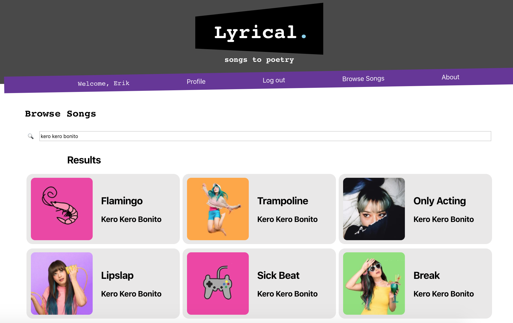
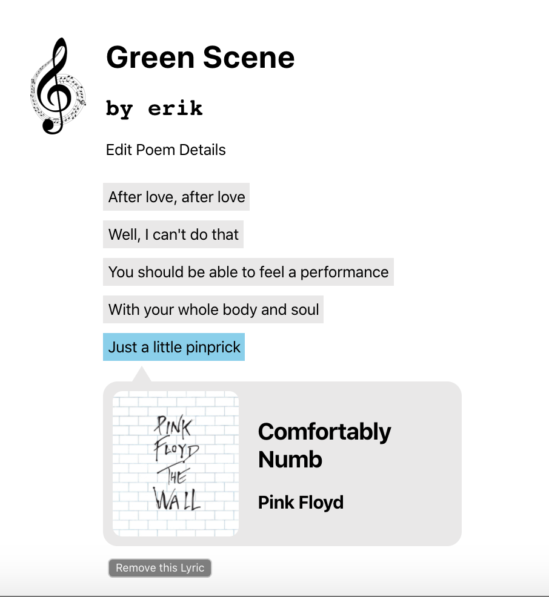
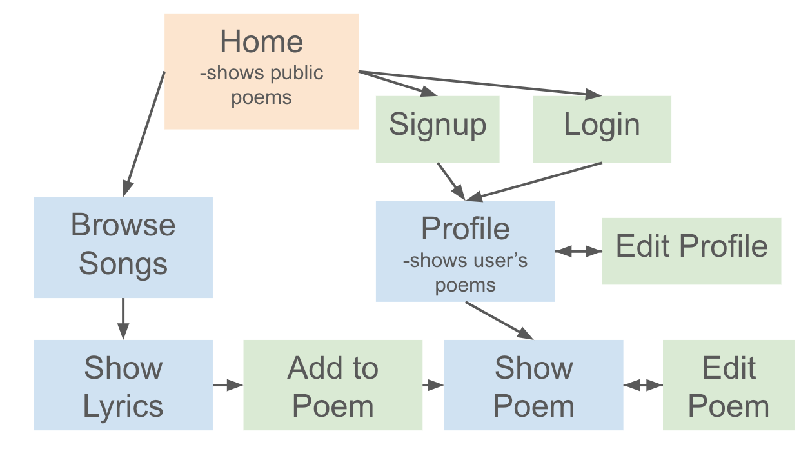
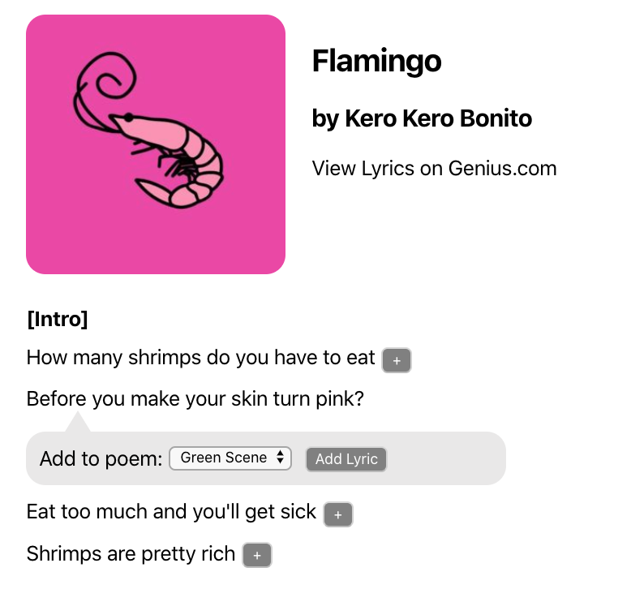
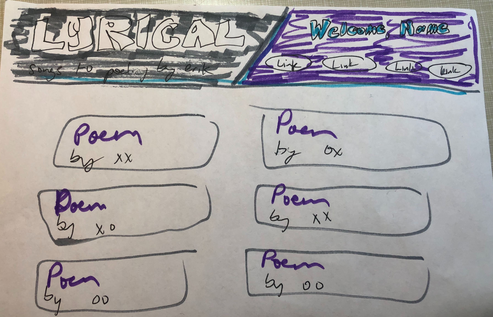

# P4: Lyrical (Genius Poetry Corner)

Lyrical allows users to search for lyrics of their favorite songs and add individual lyrics to poems they have created. Essentially, a user can create poetry using different song lyrics.

## Tech Stack
**Front end:** React

**Back end:** Python, Flask, SQLAlchemy (PostGresSQL)

**APIs:** Genius API ([link](https://docs.genius.com/#/getting-started-h1))

## MVP

Create a web application using a React front end and Flask (python) back end that allows users to make poems and add song lyrics to them. 

*One user's poem. The name of the song is displayed for each lyric added.*

## Models

### 1. User
| Column | Type | Other |
|--------|------|-------|
| Id | Integer | PK |
| Name | String | Required|
| Email | String | Required, Unique |
| Password | Password | Limit 8-30 char

### 2. Poem (1 user: Many Poems)
| Column | Type | Other |
|--------|------|-------|
| Id | Integer | PK |
| Title | String | Required |
| Public | Boolean | 
| UserID | Integer | FK

### 3. Lyric (1: Poem: Many Lyrics)
| Column | Type | Other |
|--------|------|-------|
| Id | Integer | PK |
| Song | String |
| Artist | String | 
| Thumbnail | String |
| Path | String |
| Content | String |
| Annotation | String |
| Order | Integer |
| PoemID| Integer | FK

## Routes

*User Flow Diagram*

### Back End (Flask)

| Type | Address | Description|
|------|---------|------------|
|GET| /profile | Send user data |
|PUT| /profile | Update user data |
|GET| /poems | Get all poems|
|POST| /poems | Post a poem |
|GET| /poems/:id | Send poem info |
|PUT| /poems/:id | Edit poem |
|DELETE | /poems/:id | Delete poem |
|POST| /poems/:id | Add a new lyric |
|DELETE| /poems/:id/lyrics/:id | Delete a lyric |
|POST| /auth/login | Log user in
|POST| /auth/signup | Create new user
| - | /auth/logout | Log user out

### Front End (React Components)
| Address | Description|
|------|---------|
|/ |Homepage/show all public poems| 
|/profile| Profile page |
|/profile/edit| Form to edit profile 
|/results| Results page with a list of songs | 
|/results/:id | Page for one song 
|/poems/new| Form to make a new poem 
|/poems/:id| Page to show a poem 
|/poems/:id/edit| Form to edit a poem 
|/auth/login| Form to login | 
|/auth/signup| Form to sign up | 

## Tech

### Genius API
1. Using a user's query from searchbar, the Genius API is queried to show a list of songs in /results
2. Each song result will have a generic http path to the lyrics page. This path is passed to the back end.
3. Backend uses python data scraping to get the lyrics and return them to the front end page, /results/:id
4. Front end renders song lyrics from back end, with artist and title

*Song Lyrics scraped from the Genius website*

## Project Log

### Friday
* Planned schemas
* Planned front and back end routes
* Established initial file structure 
* Stubs for routes in front and back end

### Sat/Sun
* Built functioning React routes with page stubs
* Researched OAuth with Genius API and React

### Monday
* Generated Auth Token to get song results from api
* Finished /results page that shows song results from Genius api based on the user query
* Successfully tested data scraping in python to get lyrics from Genius
	- [Luckily, someone already wrote the script for it](https://bigishdata.com/2016/09/27/getting-song-lyrics-from-geniuss-api-scraping/)

### Tuesday
* Successfully displaying lyrics on the React front end
* Wrote models for User, Poem, and Lyrics
* Started to implement flask auth
* Wrote React Components for auth on front end

### Wednesday
* Struggled with flask/React auth
* Wrote back end flask/SQLAlchemy crud methods and routes
* Worked on front end React components for profile and poems pages
* Drew wireframes

*Initial wireframe*

### Thursday
* Implemented auth in flask
* Successfully tested front end auth in React
* Added React components for Poem and Lyric CRUD

### Friday
* Finished routes (front to back) to show and add poems

### Saturday
* Finished route to add and delete lyrics
* Finished route to delete a poem
### Sunday
* Added styling to all components
* Finished writing Readme

## Stretch Goals & Unsolved Problems
* React forms and edit routes are still tricky. May return to them later.
* Being able to drag and drop lyrics into a particular order
* Using pandas to find the most commonly cited artist and song, and display this information on the homepage

